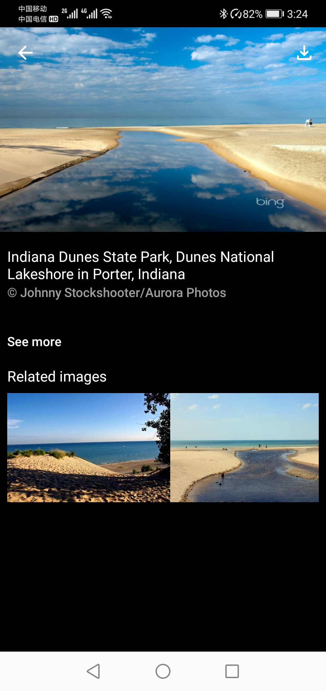

Today's Bing
============

An Image app show images of Microsoft Bing.

Introduction
------------

* Language
  * Chinese (zh)
  * English (en)

* Resources & Content reference from
  * Micorsoft Bing
[Micorsoft Bing](https://www.bing.com/)
  * Bing Wallpapers
[Bing Wallpapers](https://play.google.com/store/apps/details?id=com.microsoft.bing.wallpapers&hl=en_US&gl=US)
[Microsoft Corporation](https://play.google.com/store/apps/dev?id=6720847872553662727)

Getting Started
---------------

[Today's Bing 1.0(1)](app/release/app-release.apk?raw=true)    [DOWNLOAD](app/release/app-release.apk?raw=true)

Screenshots
-----------

Libraries Used
--------------

* Third party and miscellaneous libraries
  * [Glide][0] for image loading
  * [KenBurnsView][1]: Android library that provides an extension to ImageView that creates an immersive experience by animating its drawable using the Ken Burns Effect.
  * [Retrofit][2] A type-safe HTTP client for Android and Java

[0]: https://bumptech.github.io/glide/
[1]: https://github.com/flavioarfaria/KenBurnsView
[2]: https://github.com/square/retrofit

License
-------

Copyright 2021 Liu Xue.

Licensed to the Apache Software Foundation (ASF) under one or more contributor
license agreements.  See the NOTICE file distributed with this work for
additional information regarding copyright ownership.  The ASF licenses this
file to you under the Apache License, Version 2.0 (the "License"); you may not
use this file except in compliance with the License.  You may obtain a copy of
the License at

  http://www.apache.org/licenses/LICENSE-2.0

Unless required by applicable law or agreed to in writing, software
distributed under the License is distributed on an "AS IS" BASIS, WITHOUT
WARRANTIES OR CONDITIONS OF ANY KIND, either express or implied.  See the
License for the specific language governing permissions and limitations under
the License.
